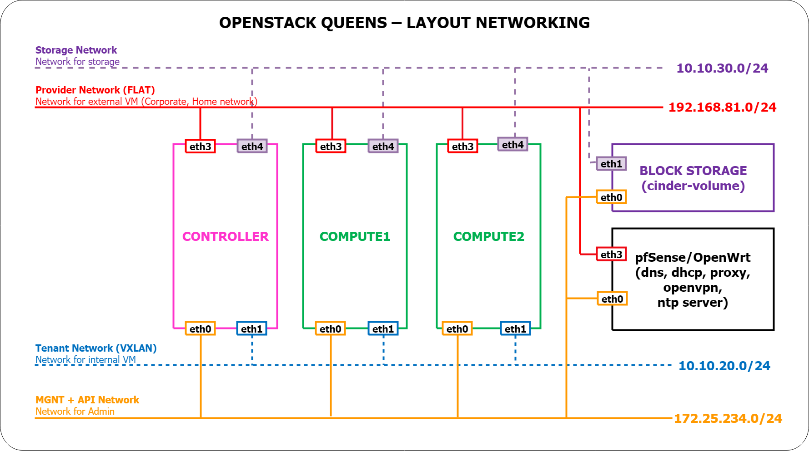
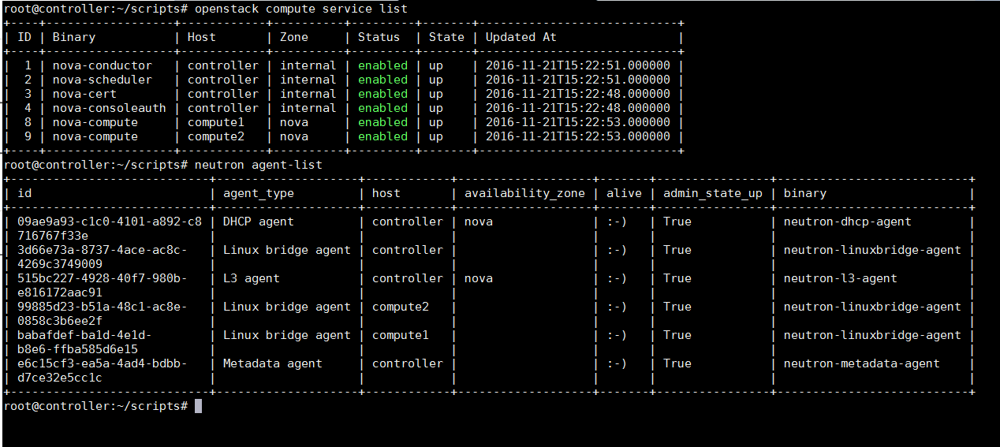

# OpenStack Queens LAB

Mini LAb setup OpenStack on multi node

## Topology




## Initial

- Download git & scripts

```sh
apt-get -y update && apt-get -y install git-core
git clone https://github.com/congto/OpenStack-Newton-Scripts.git /root/openstack
cd /root/openstack/scripts
chmod -R +x *.sh
```

- You can edit `config.cfg` file if needed

## Controller Node

- SSH with `root` account and run scripts on controller node

```sh
./setup01.sh controller
./setup02.sh controller
./setup03.sh controller
```

## Compute1 to ComputeN Nodes

- SSH with `root` account and run scripts on compute node

```sh
./setup01.sh compute1
./setup02.sh compute1
./setup03.sh compute1
```

- Run command on Controller node for update compute list

```sh
su -s /bin/sh -c "nova-manage cell_v2 discover_hosts --verbose" nova
```

## Seed initial data & test OpenStack operation

- On Controller node, run

```sh
. admin-openrc
./create-vm.sh
```

## Login dashboad

- Dashboard: `192.168.81.30/horizon`
- User : `admin/Welcome123`

## Screenshot




## Credit

Origin Project: https://github.com/vietstacker/OpenStack-Newton-Scripts
