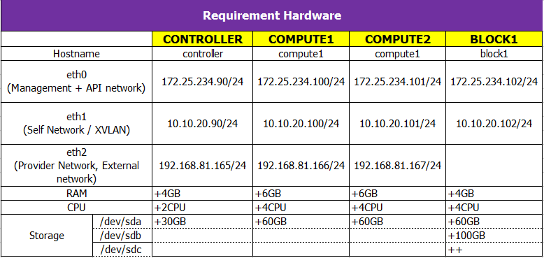

# OpenStack Queens LAB

A small script used for deploy OpenStack Queens

Supported OS:
- Ubuntu Xenial 16.04 LTS
- Ubuntu Bionic Beaver 18.4 LTS

## Topology


## Hardware requirements



# Step 1: Network setup

Changing network interfaces name

Edit your /etc/default/grub changing the line from `GRUB_CMDLINE_LINUX=""` to `GRUB_CMDLINE_LINUX="net.ifnames=0 biosdevname=0"`
and, finally:

```sh
sudo update-grub
sudo reboot
```

## Ubuntu 16.04
Manual configure IP address for all node at `/etc/network/interfaces`

Example config

```
```

## Ubuntu 18.04
Ubuntu 18.04 move `/etc/network/interfaces` to netplan. You need update IP config at `/etc/netplan/*.yaml` 

Example config

```
```

# Step 2: Install OpenStack
- Download git & scripts

```sh
apt-get -y update && apt-get -y install git-core
git clone https://github.com/pt-studio/openstack-queens-labs.git /root/openstack
cd /root/openstack/scripts
chmod -R +x *.sh
```

- Generate new config file or use preconfig file at `out/vars`

```sh
cd scripts/
virtualenv -p python3 venv
. venv/bin/activate
pip install -r requirements.txt
python util/generate_config.py
```

## Controller

- SSH with `root` account and run scripts

```sh
./setup01.sh
./setup02.sh controller
./setup03.sh controller
```

## Compute1 to ComputeN

- SSH with `root` account and run scripts

```sh
./setup01.sh
./setup02.sh computeI
./setup03.sh computeI
```

## Block1 to BlockN

- SSH with `root` account and run scripts

```sh
./setup01.sh
./setup02.sh blockI
./setup03.sh blockI
```

# Step 3: Test operation
## Create network, VM

- On Controller node, run

```sh
./create-vm.sh
```

## Login dashboad

- Dashboard: `http://horizon-fqdn/horizon`
- User : `admin/yourpassword`

## Check by command or dashboard


# Credit
Thanks to @congto https://github.com/congto/OpenStack-Newton-Scripts

# License

```
Copyright 2018 PT Studio.

Licensed under the Apache License, Version 2.0 (the "License");
you may not use this file except in compliance with the License.
You may obtain a copy of the License at

   http://www.apache.org/licenses/LICENSE-2.0

Unless required by applicable law or agreed to in writing, software
distributed under the License is distributed on an "AS IS" BASIS,
WITHOUT WARRANTIES OR CONDITIONS OF ANY KIND, either express or implied.
See the License for the specific language governing permissions and
limitations under the License.
```